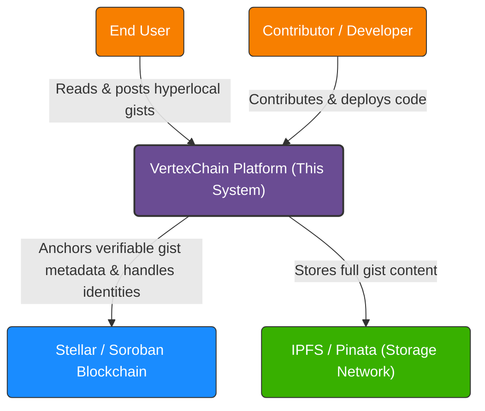
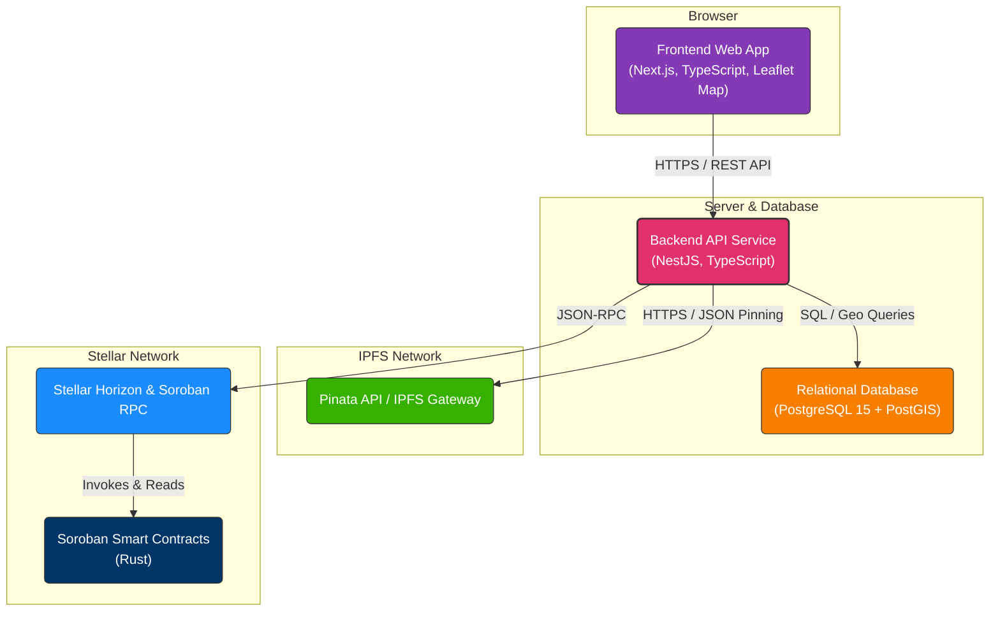
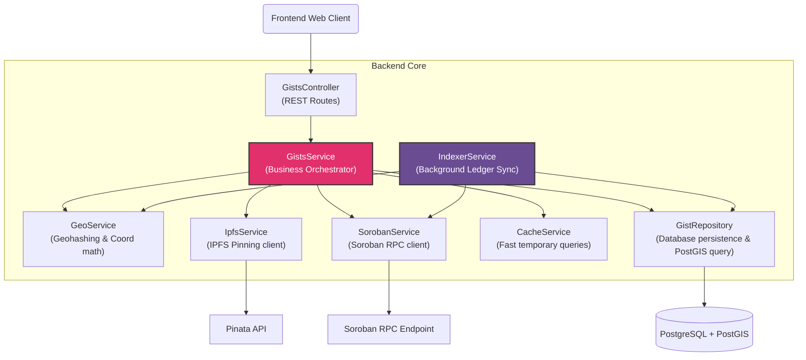
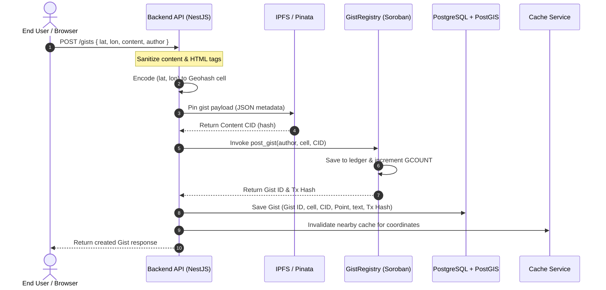
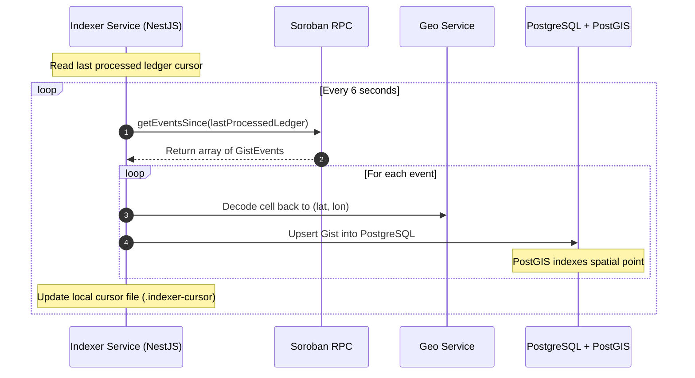

# VertexChain System Architecture

This document describes the architectural design, components, and key data flows of the **VertexChain** platform. It is structured according to the **C4 Model** (Context, Containers, Components) to provide a clear, layered understanding of the system for developers and contributors.

---

## Table of Contents
1. [System Context (Level 1)](#system-context-level-1)
2. [Containers (Level 2)](#containers-level-2)
3. [Components (Level 3)](#components-level-3)
   - [Backend API Components](#backend-api-components)
   - [Soroban Smart Contracts](#soroban-smart-contracts)
4. [Key Data Flows](#key-data-flows)
   - [Gist Creation and Registration Flow](#gist-creation-and-registration-flow)
   - [On-Chain Event Indexing Flow](#on-chain-event-indexing-flow)

---

## System Context (Level 1)

The System Context diagram provides a high-level view of VertexChain and how it interacts with users and external services.

### Context Entities
- **End User**: A mobile or web visitor who wants to read local messages ("gists") posted nearby or post their own gists (optionally signing with a Stellar identity).
- **Stellar / Soroban Blockchain**: The decentralized network hosting the smart contracts that record gist registration history, handle multi-signature wallets, and execute governance tasks.
- **IPFS / Pinata**: A peer-to-peer storage network where the actual text content and coordinates are pinned, returning a content identifier (CID/hash) to keep on-chain storage fees low.

---

## Containers (Level 2)

The Container diagram shows the high-level technical choices and how they communicate with each other.

### Containers Detailed
1. **Frontend Web App (Next.js)**: Serves the map interface to the user. It queries the backend API to render gists on an interactive OpenStreetMap view (via React-Leaflet) and prompts users to create gists.
2. **Backend API Service (NestJS)**: The core orchestrator. It receives gist creation requests, pins payloads to IPFS, invokes transactions on Soroban, and coordinates query logic.
3. **Database (PostgreSQL + PostGIS)**: Stores the indexed local copy of all gists. PostGIS is utilized to perform fast spatial queries (e.g. searching all gists within a 500m radius of given coordinates).
4. **Pinata (IPFS)**: Provides pinning services to ensure gists' content remains accessible without hosting complex distributed nodes directly.
5. **Soroban Smart Contracts**: Rust contracts deployed on the Stellar network to anchor immutable proof of gist creation and manage multisig wallets, governance, and batch wallet operations.

---

## Components (Level 3)

### Backend API Components

Inside the **Backend API Service** container, the following NestJS modules and services manage the logic:

#### Backend Modules & Roles
- **GistsController**: Exposes REST routes (`GET /gists`, `POST /gists`, `GET /gists/:id`). Performs input sanitation (e.g., stripping HTML tags) and delegates requests.
- **GistsService**: Implements transaction coordination. Coordinates pinning files, calling Soroban contracts, saving database records, and invalidating cached queries.
- **GeoService**: Contains custom algorithms for encoding latitude/longitude coordinates into geohash cells (used on-chain for location sorting) and decoding geohashes back to coordinates.
- **IpfsService**: Interacts with Pinata API to pin JSON metadata representing the gist content.
- **SorobanService**: Interacts with Soroban RPC. Supports a mock mode if no contract address is configured, easing offline/local development.
- **CacheService**: Speeds up coordinate queries by caching nearby gists for a brief duration (e.g., 60 seconds), invalidating it upon new local posts.
- **IndexerService**: A background polling service that monitors Soroban events, retrieves newly registered gists on-chain, and syncs them into the local PostgreSQL database to guarantee data consistency.

---

### Soroban Smart Contracts

The contracts layer is compiled to WASM and runs within the Stellar VM.

```mermaid
classDiagram
    class GistRegistry {
        +post_gist(Option~Address~ author, String location_cell, String content_hash) u64
        +get_gist(u64 gist_id) Option~Gist~
        +list_gists_by_cell(String location_cell, u64 cursor, u32 limit) Vec~Gist~
    }
    class Multisig {
        +initialize(Address admin) void
        +set_signers(Address caller, Vec~Address~ signers, u32 threshold) void
        +submit_transaction(Address caller, Address to, i128 amount, Bytes payload, Address asset) u64
        +approve_transaction(Address caller, u64 tx_id) void
        +execute_transaction(Address caller, u64 tx_id) void
    }
    class Governance {
        +initialize(Address admin, u32 required_approvals) void
        +create_proposal(Address proposer, String config_key, String config_value, u64 duration_seconds) u64
        +vote_proposal(Address voter, u64 proposal_id) void
        +execute_proposal(Address caller, u64 proposal_id) void
        +get_config(String config_key) Option~String~
    }
    class BatchWallet {
        +initialize(Address admin) void
        +batch_create_wallets(Address caller, Vec~CreateRequest~ requests) void
        +batch_recover_wallets(Address caller, Vec~RecoverRequest~ requests) void
        +get_wallet(Address owner) Option~WalletInfo~
    }
```

- **GistRegistry**: The primary registry. Keeps an auto-incremented gist counter (`GCOUNT`) and maps unique IDs to `Gist` structs. Emits events for indexer tracking.
- **Multisig**: Enables secure group coordination by requiring a threshold of authorization before executing specific contract actions.
- **Governance**: Allows decentralized proposal creation and parameter voting, persisting configured network variables dynamically.
- **BatchWallet**: Optimizes gas fees and setup steps by initializing or recovering multiple user accounts in single transactions.

---

## Key Data Flows

### Gist Creation and Registration Flow

This sequence diagram illustrates what happens when an end-user creates a new gist.

---

### On-Chain Event Indexing Flow

This flow maintains consistency for gists posted to the registry contract directly on-chain or via alternative entry points.

